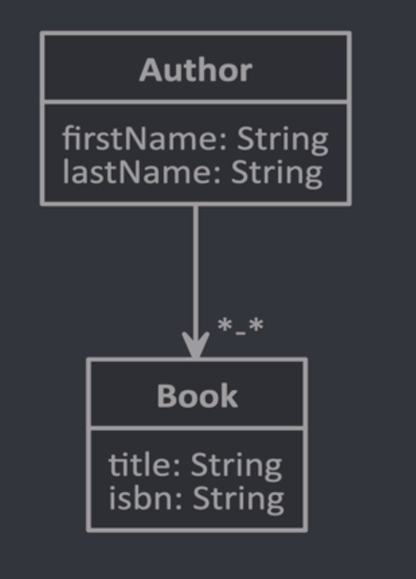
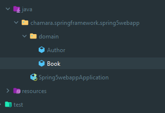
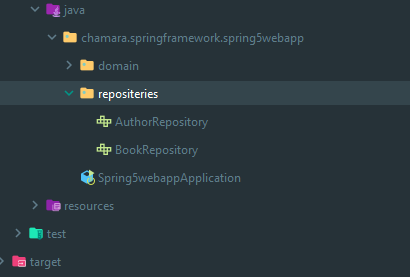
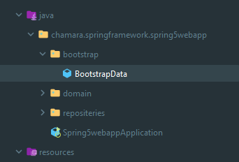
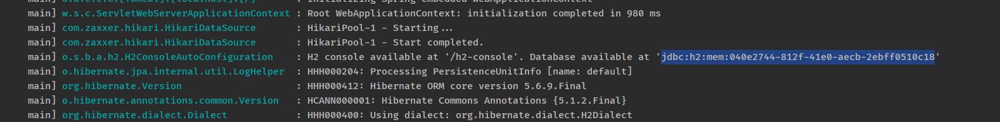
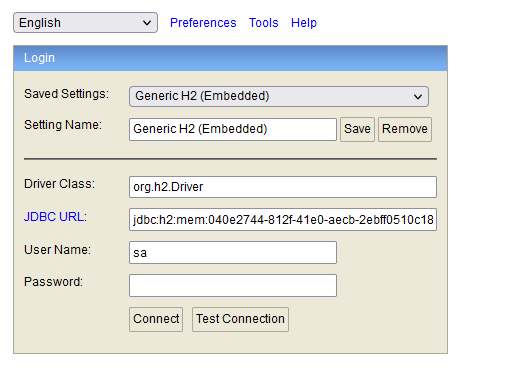
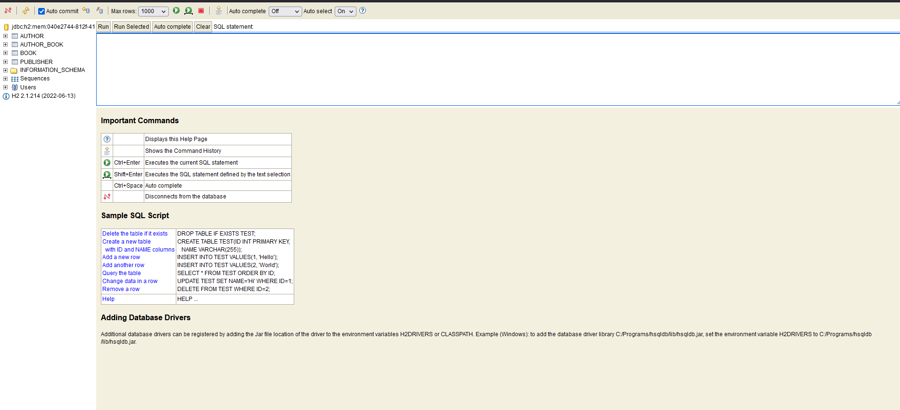
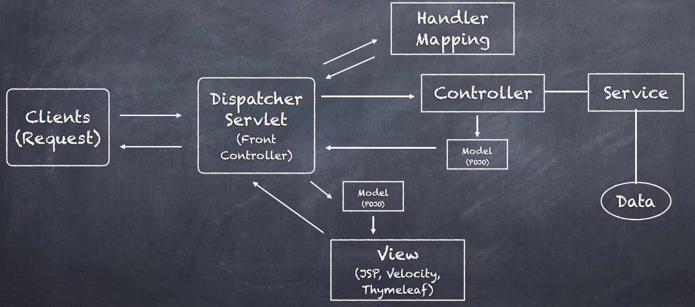
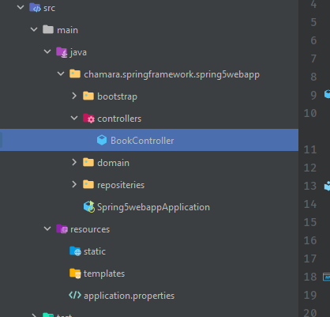

# 2. Building a Spring Boot Web App

- [2. Building a Spring Boot Web App](#2-building-a-spring-boot-web-app)
  - [6. JPA Entities](#6-jpa-entities)
    - [JPA Model](#jpa-model)
    - [Creating POJOS](#creating-pojos)
    - [What is POJO](#what-is-pojo)
    - [Let's create POJOS for Author](#lets-create-pojos-for-author)
      - [Code Examples](#code-examples)
  - [7. Equality in Hibernate](#7-equality-in-hibernate)
    - [Let's Generate Equals and hashCode methods](#lets-generate-equals-and-hashcode-methods)
      - [Code Examples](#code-examples-1)
    - [Let's Generate toString method](#lets-generate-tostring-method)
  - [8. Spring Data Repositories](#8-spring-data-repositories)
    - [Repositories](#repositories)
  - [9. Initializing Data with Spring](#9-initializing-data-with-spring)
  - [10. Add Publisher Entity](#10-add-publisher-entity)
  - [11. Publisher Relationships](#11-publisher-relationships)
  - [12. H2 Database Console](#12-h2-database-console)
  - [13. Introduction to Spring MVC](#13-introduction-to-spring-mvc)
    - [what is MVC](#what-is-mvc)
    - [MVC](#mvc)
    - [SPRING MVC](#spring-mvc)
  - [14. Configuring Spring MVC Controllers](#14-configuring-spring-mvc-controllers)
  - [15. Thymeleaf Templates](#15-thymeleaf-templates)
  - [17. Introduction to Spring Pet Clinic](#17-introduction-to-spring-pet-clinic)
  - [18. Running Spring Pet Clinic](#18-running-spring-pet-clinic)
  - [19. Intro to SFG Version of Spring PetClinic Application](#19-intro-to-sfg-version-of-spring-petclinic-application)
  - [20. Spring Pet Clinic - Initializing Spring PetClinic Application](#20-spring-pet-clinic---initializing-spring-petclinic-application)
  - [21. Spring Pet Clinic - Task Planning](#21-spring-pet-clinic---task-planning)

## 6. JPA Entities

### JPA Model



Author and Books have Many to Many Relationship.

### Creating POJOS

### What is POJO

`POJO stands for Plain Old Java Object. It is an ordinary Java object, not bound by any special restriction other than those forced by the Java Language Specification and not requiring any classpath. POJOs are used for increasing the readability and re-usability of a program. POJOs have gained the most acceptance because they are easy to write and understand. They were introduced in EJB 3.0 by Sun microsystems.`

- [Reference Link](https://www.geeksforgeeks.org/pojo-vs-java-beans/#:~:text=POJO%20classes,re%2Dusability%20of%20a%20program.)

### Let's create POJOS for Author

#### Code Examples

Author Class

```java
package chamara.springframework.spring5webapp.domain;

import javax.persistence.*;
import java.util.Set;

@Entity
public class Author {
    @Id
    @GeneratedValue(strategy = GenerationType.AUTO)
    private Long id;
    private String firstName;
    private String lastName;

    @ManyToMany(mappedBy = "authors")
    private Set<Book> books = new HashSet<>();

    public Author() {
    }

    public Long getId() {
        return id;
    }

    public void setId(Long id) {
        this.id = id;
    }

    public Author(String firstName, String lastName, Set<Book> books) {
        this.firstName = firstName;
        this.lastName = lastName;
        this.books = books;
    }

    public String getFirstName() {
        return firstName;
    }

    public void setFirstName(String firstName) {
        this.firstName = firstName;
    }

    public String getLastName() {
        return lastName;
    }

    public void setLastName(String lastName) {
        this.lastName = lastName;
    }

    public Set<Book> getBooks() {
        return books;
    }

    public void setBooks(Set<Book> books) {
        this.books = books;
    }
}

```

Book Class

```java
package chamara.springframework.spring5webapp.domain;

import javax.persistence.*;
import java.util.Set;

@Entity
public class Book {
    @Id
    @GeneratedValue(strategy = GenerationType.AUTO)
    private Long id;
    private String title;
    private String isbn;

    @ManyToMany()
    @JoinTable(name = "author_book", joinColumns = @JoinColumn(name = "book_id"), inverseJoinColumns = @JoinColumn(name = "author_id"))
    private Set<Author> authors = new HashSet<>();

    public Book() {
    }

    public Book(String title, String isbn, Set<Author> authors) {
        this.title = title;
        this.isbn = isbn;
        this.authors = authors;
    }

    public Long getId() {
        return id;
    }

    public void setId(Long id) {
        this.id = id;
    }

    public String getTitle() {
        return title;
    }

    public void setTitle(String title) {
        this.title = title;
    }

    public String getIsbn() {
        return isbn;
    }

    public void setIsbn(String isbn) {
        this.isbn = isbn;
    }

    public Set<Author> getAuthors() {
        return authors;
    }

    public void setAuthors(Set<Author> authors) {
        this.authors = authors;
    }
}


```



## 7. Equality in Hibernate

### Let's Generate Equals and hashCode methods

For Both Author and Book POJOs

#### Code Examples

```java
    @Override
    public boolean equals(Object o) {
        if (this == o) return true;
        if (o == null || getClass() != o.getClass()) return false;

        Author author = (Author) o;

        return id != null ? id.equals(author.id) : author.id == null;
    }

    @Override
    public int hashCode() {
        return id != null ? id.hashCode() : 0;
    }
```

### Let's Generate toString method

```java
    @Override
    public String toString() {
        return "Author{" +
                "id=" + id +
                ", firstName='" + firstName + '\'' +
                ", lastName='" + lastName + '\'' +
                ", books=" + books +
                '}';
    }

```

## 8. Spring Data Repositories

### Repositories

let's create a package for the repositories


BookRepository

```java
package chamara.springframework.spring5webapp.repositeries;

import chamara.springframework.spring5webapp.domain.Book;
import org.springframework.data.repository.CrudRepository;

public interface BookRepository extends CrudRepository<Book, Long> {
}

```

Author Repository

```java
package chamara.springframework.spring5webapp.repositeries;

import chamara.springframework.spring5webapp.domain.Author;
import org.springframework.data.repository.CrudRepository;

public interface AuthorRepository extends CrudRepository<Author, Long> {
}

```

let's see what the CRUD repository gives us.

```java
//
// Source code recreated from a .class file by IntelliJ IDEA
// (powered by FernFlower decompiler)
//

package org.springframework.data.repository;

import java.util.Optional;

@NoRepositoryBean
public interface CrudRepository<T, ID> extends Repository<T, ID> {
    <S extends T> S save(S entity);

    <S extends T> Iterable<S> saveAll(Iterable<S> entities);

    Optional<T> findById(ID id);

    boolean existsById(ID id);

    Iterable<T> findAll();

    Iterable<T> findAllById(Iterable<ID> ids);

    long count();

    void deleteById(ID id);

    void delete(T entity);

    void deleteAllById(Iterable<? extends ID> ids);

    void deleteAll(Iterable<? extends T> entities);

    void deleteAll();
}

```

so we have access to these methods by default.

## 9. Initializing Data with Spring

let's create a Bootstrap package


Bootstrap
here @Component indicate that this is managed by Spring

```java
package chamara.springframework.spring5webapp.bootstrap;

import chamara.springframework.spring5webapp.domain.Author;
import chamara.springframework.spring5webapp.domain.Book;
import chamara.springframework.spring5webapp.repositeries.AuthorRepository;
import chamara.springframework.spring5webapp.repositeries.BookRepository;
import org.springframework.boot.CommandLineRunner;
import org.springframework.stereotype.Component;

@Component
public class BootstrapData implements CommandLineRunner {
    private final AuthorRepository authorRepository;
    private final BookRepository bookRepository;

    public BootstrapData(AuthorRepository authorRepository, BookRepository bookRepository) {
        this.authorRepository = authorRepository;
        this.bookRepository = bookRepository;
    }

    @Override
    public void run(String... args) throws Exception {
        Author eric = new Author("eric", "evans");
        Book add = new Book("Design driven development", "123123123");
        eric.getBooks().add(add);
        add.getAuthors().add(eric);

        authorRepository.save(eric);
        bookRepository.save(add);

        Author rod = new Author("rod", "Johnson");
        Book noEJB = new Book("J2EE", "546234121231");

        rod.getBooks().add(noEJB);
        noEJB.getAuthors().add(rod);

        authorRepository.save(rod);
        bookRepository.save(noEJB);

        System.out.println("Started in Bootstrap");
        System.out.println("Number of Books : " + bookRepository.count());
    }
}

```

Author POJO

```java
    @ManyToMany(mappedBy = "authors")
    private Set<Book> books = new HashSet<>();
```

Book POJO

```java
@ManyToMany()
    @JoinTable(name = "author_book", joinColumns = @JoinColumn(name = "book_id"), inverseJoinColumns = @JoinColumn(name = "author_id"))
    private Set<Author> authors = new HashSet<>();
```

## 10. Add Publisher Entity

Let's create a Publisher POJO

```java
package chamara.springframework.spring5webapp.domain;

import javax.persistence.*;
import java.util.HashSet;
import java.util.Set;

@Entity
public class Publisher {
    @Id
    @GeneratedValue(strategy = GenerationType.AUTO)
    private Long id;

    private String name;
    private String addressLine1;
    private String city;
    private String state;
    private String zipcode;
    @OneToMany
    @JoinColumn(name = "publisher_id")
    private Set<Book> books = new HashSet<>();

    public Publisher() {
    }

    public Set<Book> getBooks() {
        return books;
    }

    public void setBooks(Set<Book> books) {
        this.books = books;
    }

    @Override
    public String toString() {
        return "Publisher{" +
                "id=" + id +
                ", name='" + name + '\'' +
                ", addressLine1='" + addressLine1 + '\'' +
                ", city='" + city + '\'' +
                ", state='" + state + '\'' +
                ", zipcode='" + zipcode + '\'' +
                ", books=" + books +
                '}';
    }

    @Override
    public boolean equals(Object o) {
        if (this == o) return true;
        if (o == null || getClass() != o.getClass()) return false;

        Publisher publisher = (Publisher) o;

        return id != null ? id.equals(publisher.id) : publisher.id == null;
    }

    @Override
    public int hashCode() {
        return id != null ? id.hashCode() : 0;
    }

    public Long getId() {
        return id;
    }

    public void setId(Long id) {
        this.id = id;
    }

    public String getName() {
        return name;
    }

    public void setName(String name) {
        this.name = name;
    }

    public String getAddressLine1() {
        return addressLine1;
    }

    public void setAddressLine1(String addressLine1) {
        this.addressLine1 = addressLine1;
    }

    public String getCity() {
        return city;
    }

    public void setCity(String city) {
        this.city = city;
    }

    public String getState() {
        return state;
    }

    public void setState(String state) {
        this.state = state;
    }

    public String getZipcode() {
        return zipcode;
    }

    public void setZipcode(String zipcode) {
        this.zipcode = zipcode;
    }
}

```

Let's create the Publisher Repository

```java
package chamara.springframework.spring5webapp.repositeries;

import chamara.springframework.spring5webapp.domain.Publisher;
import org.springframework.data.repository.CrudRepository;

public interface PublisherRepository extends CrudRepository<Publisher, Long> {

}

```

And Create a Publisher and add to the InMemory DataBase

```java
package chamara.springframework.spring5webapp.bootstrap;

import chamara.springframework.spring5webapp.domain.Author;
import chamara.springframework.spring5webapp.domain.Book;
import chamara.springframework.spring5webapp.domain.Publisher;
import chamara.springframework.spring5webapp.repositeries.AuthorRepository;
import chamara.springframework.spring5webapp.repositeries.BookRepository;
import chamara.springframework.spring5webapp.repositeries.PublisherRepository;
import org.springframework.boot.CommandLineRunner;
import org.springframework.stereotype.Component;

@Component
public class BootstrapData implements CommandLineRunner {
    private final AuthorRepository authorRepository;
    private final BookRepository bookRepository;

    private final PublisherRepository publisherRepository;

    public BootstrapData(AuthorRepository authorRepository, BookRepository bookRepository, PublisherRepository publisherRepository) {
        this.authorRepository = authorRepository;
        this.bookRepository = bookRepository;
        this.publisherRepository = publisherRepository;
    }

    @Override
    public void run(String... args) throws Exception {

        Publisher publisher = new Publisher();
        publisher.setName("SFG Publishing");
        publisher.setCity("St PetersBerg");
        publisher.setState("Fl");

        publisherRepository.save(publisher);

        System.out.println("Publisher Count : " + publisherRepository.count());

        Author eric = new Author("eric", "evans");
        Book add = new Book("Design driven development", "123123123");
        eric.getBooks().add(add);
        add.getAuthors().add(eric);

        add.setPublisher(publisher);
        publisher.getBooks().add(add);

        authorRepository.save(eric);
        bookRepository.save(add);
        publisherRepository.save(publisher);

        Author rod = new Author("rod", "Johnson");
        Book noEJB = new Book("J2EE", "546234121231");

        add.setPublisher(publisher);
        publisher.getBooks().add(noEJB);
        rod.getBooks().add(noEJB);
        noEJB.getAuthors().add(rod);

        authorRepository.save(rod);
        bookRepository.save(noEJB);
        publisherRepository.save(publisher);

        System.out.println("Started in Bootstrap");
        System.out.println("Number of Books : " + bookRepository.count());
        System.out.println("Publisher Number of Books : " + publisher.getBooks().size());
    }
}

```

output

```shell
Publisher Count : 1
Started in Bootstrap
Number of Books : 2
Publisher Number of Books : 2
```

## 11. Publisher Relationships

we are adding this to the publisher because one publisher has many books.
and we are adding getters and setters foe the books property.

```java
   @OneToMany
    @JoinColumn(name = "publisher_id")
    private Set<Book> books = new HashSet<>();

        public Set<Book> getBooks() {
        return books;
    }

    public void setBooks(Set<Book> books) {
        this.books = books;
    }
```

and we are adding this because one book can have one publisher. one publisher can have many books. and setters and getters are added to.

```java
    @ManyToOne
    private Publisher publisher;

        public Publisher getPublisher() {
        return publisher;
    }

    public void setPublisher(Publisher publisher) {
        this.publisher = publisher;
    }
```

so as you can see we haven't wrote any sql statements. because JPA is generating the SQL queries for us.

## 12. H2 Database Console

go to application.properties
add the following

```java
spring.h2.console.enabled=true
```



then go to

[http://localhost:8080/h2-console](http://localhost:8080/h2-console)



output



## 13. Introduction to Spring MVC

### what is MVC


### MVC


### SPRING MVC



## 14. Configuring Spring MVC Controllers

let's create a new package called Controllers.

let's create a bookController



```java
package chamara.springframework.spring5webapp.controllers;

import chamara.springframework.spring5webapp.repositeries.BookRepository;
import org.springframework.stereotype.Controller;
import org.springframework.ui.Model;
import org.springframework.web.bind.annotation.RequestMapping;

@Controller
public class BookController {

    private final BookRepository bookRepository;

    public BookController(BookRepository bookRepository) {
        this.bookRepository = bookRepository;
    }

    @RequestMapping("/books")
    public String getBooks(Model model) {
        model.addAttribute("books", bookRepository.findAll());
        return "books";
    }
}

```

## 15. Thymeleaf Templates

```java

```

```java

```

## 17. Introduction to Spring Pet Clinic

## 18. Running Spring Pet Clinic

## 19. Intro to SFG Version of Spring PetClinic Application

## 20. Spring Pet Clinic - Initializing Spring PetClinic Application

## 21. Spring Pet Clinic - Task Planning
