# Dependency Injection

- [Dependency Injection](#dependency-injection)
  - [SOLID Principles of OOP](#solid-principles-of-oop)
  - [Create Spring DI Example Project](#create-spring-di-example-project)
  - [The Spring Context](#the-spring-context)
  - [Basics of Dependency Injection](#basics-of-dependency-injection)
  - [Dependency Injection without Spring](#dependency-injection-without-spring)
  - [Dependency Injection using Spring Framework](#dependency-injection-using-spring-framework)
  - [Using Qualifiers](#using-qualifiers)
  - [Primary Beans](#primary-beans)
  - [Spring Profiles](#spring-profiles)
  - [Spring Bean Life Cycle](#spring-bean-life-cycle)
  - [Questions](#questions)
  - [Spring Bean Life Cycle Demo](#spring-bean-life-cycle-demo)
  - [Flashcards](#flashcards)
  - [Open Closed Principle](#open-closed-principle)
  - [Interface Segregation Principle](#interface-segregation-principle)
  - [Dependency Inversion Principle](#dependency-inversion-principle)
  - [Interface Naming Conventions](#interface-naming-conventions)
  - [Spring Pet Clinic - POJO Data Model](#spring-pet-clinic---pojo-data-model)
  - [Spring Pet Clinic - Multi-Module Maven Builds](#spring-pet-clinic---multi-module-maven-builds)
  - [Spring Pet Clinic - Using the Maven Release Plugin](#spring-pet-clinic---using-the-maven-release-plugin)
  - [Spring Pet Clinic - Create Interfaces for Services](#spring-pet-clinic---create-interfaces-for-services)
  - [Spring Pet Clinic - Implement Base Entity](#spring-pet-clinic---implement-base-entity)

## SOLID Principles of OOP


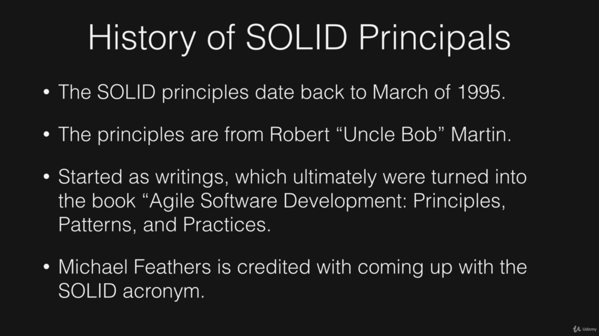
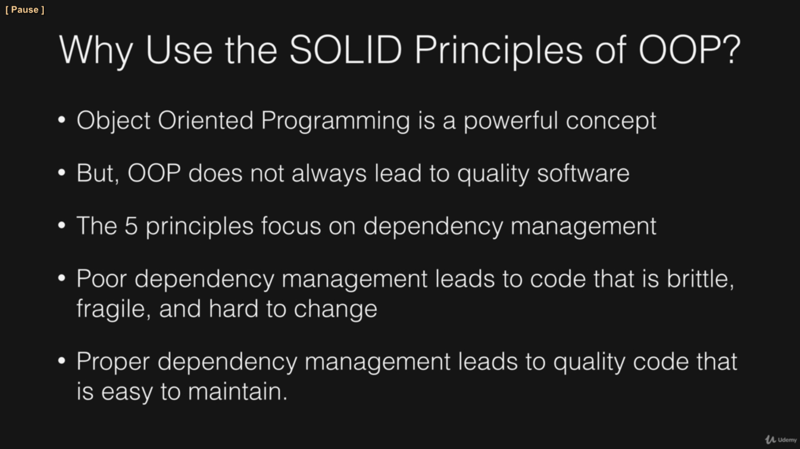
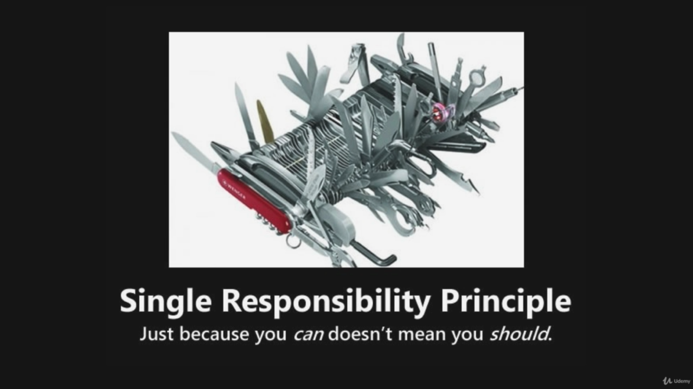
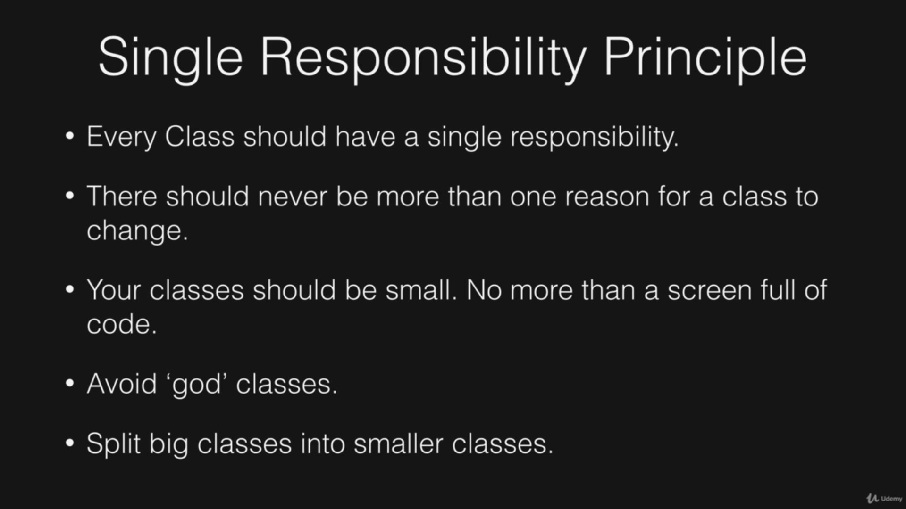

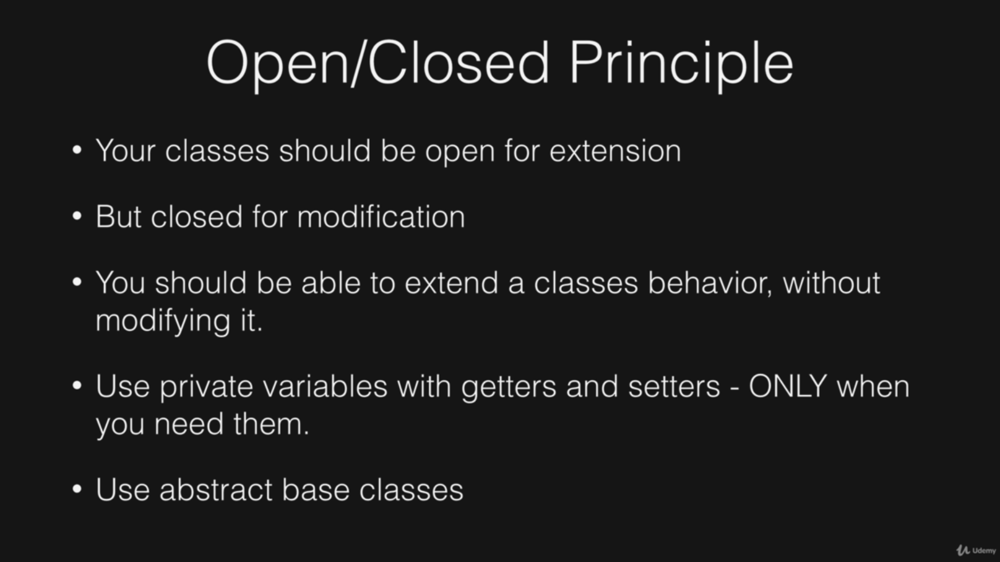
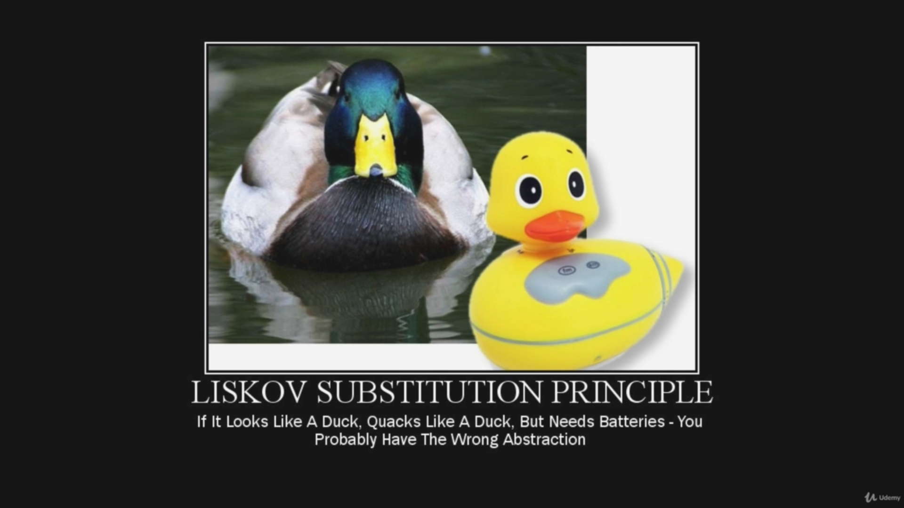
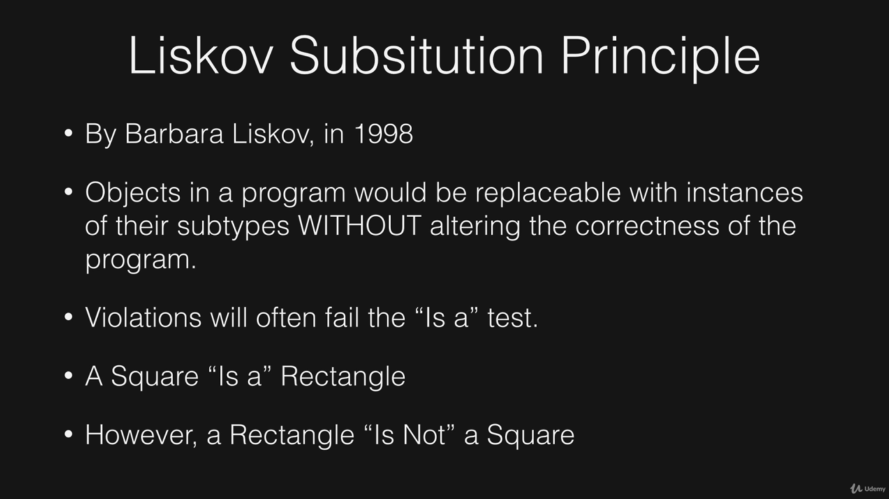
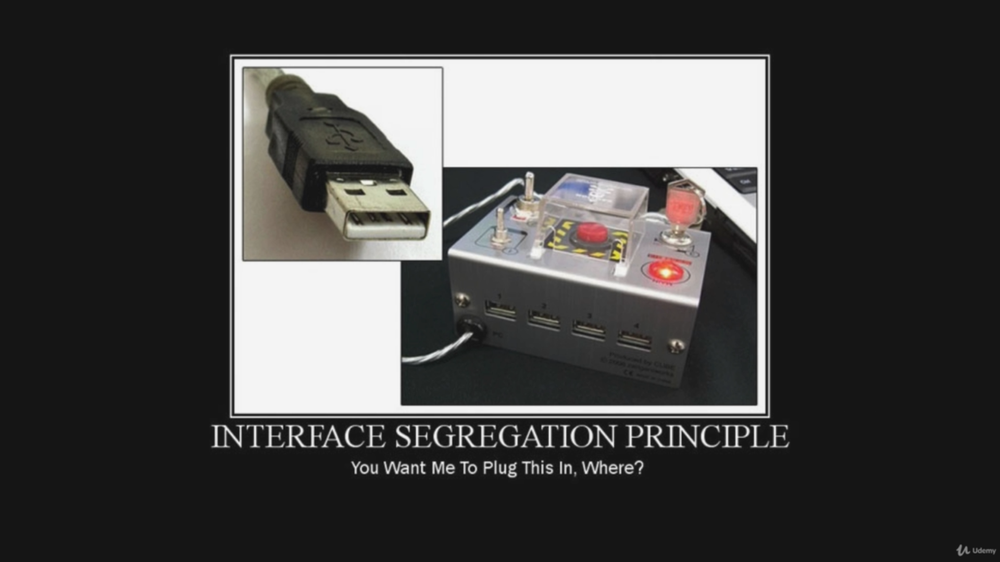
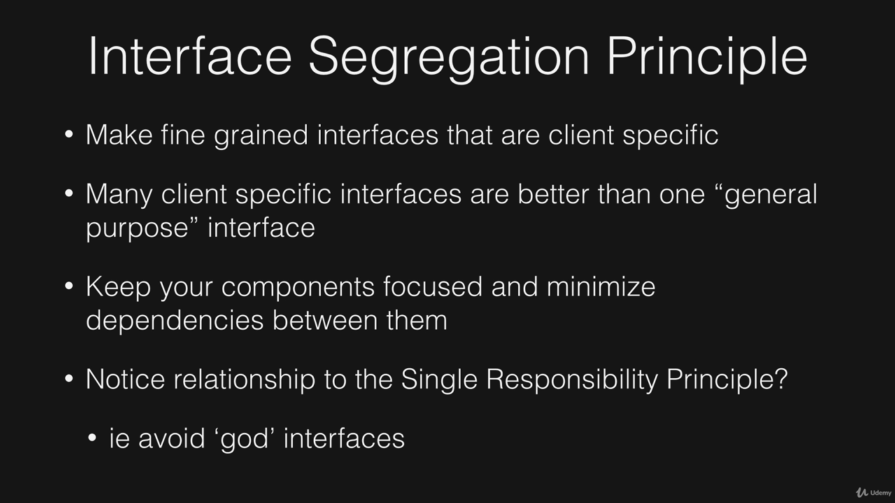

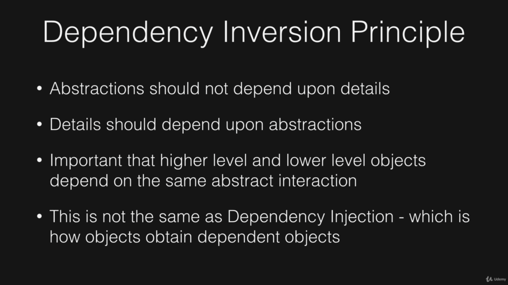
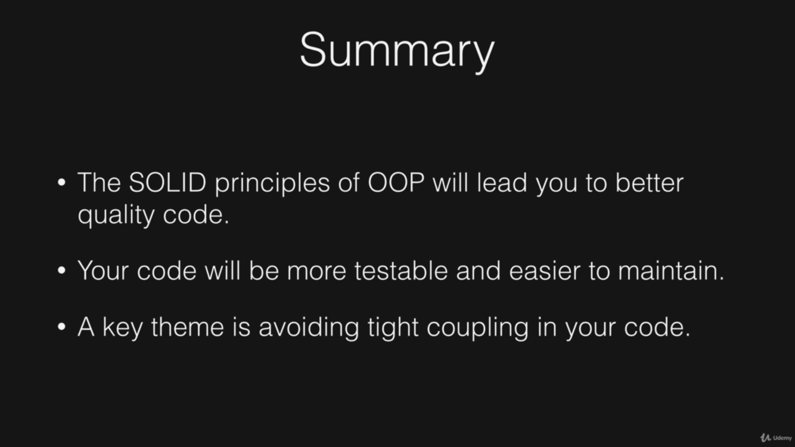

## Create Spring DI Example Project

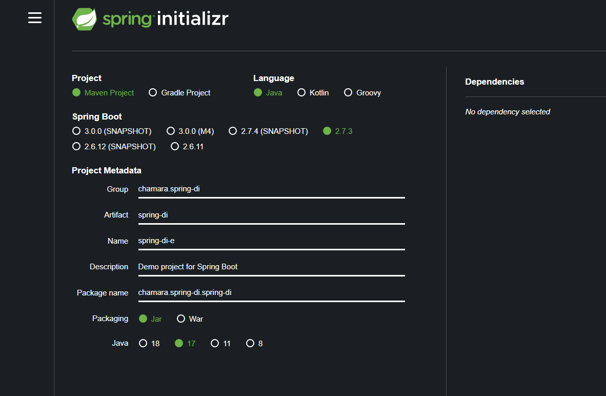

## The Spring Context

run the app with the doc inside

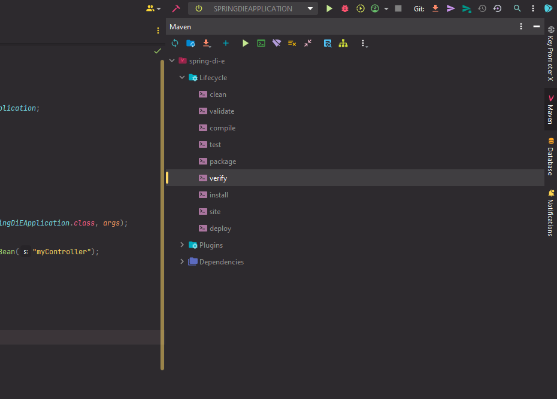
create the controller

```java
package chamara.springdi.springdi.controllers;

import org.springframework.stereotype.Controller;

@Controller
public class MyController {
    public String helloWorld() {
        System.out.println("Hello World");
        return "Hi Folks";
    }
}

```

get the context

```java
package chamara.springdi.springdi;

import chamara.springdi.springdi.controllers.MyController;
import org.springframework.boot.SpringApplication;
import org.springframework.boot.autoconfigure.SpringBootApplication;
import org.springframework.context.ApplicationContext;

@SpringBootApplication
public class SpringDiEApplication {

    public static void main(String[] args) {
        ApplicationContext ctx = SpringApplication.run(SpringDiEApplication.class, args);

        MyController myController = (MyController) ctx.getBean("myController");

        String greeting = myController.helloWorld();

        System.out.println(greeting);
    }

}

```

## Basics of Dependency Injection

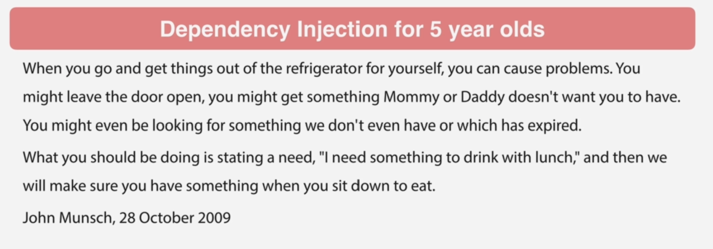
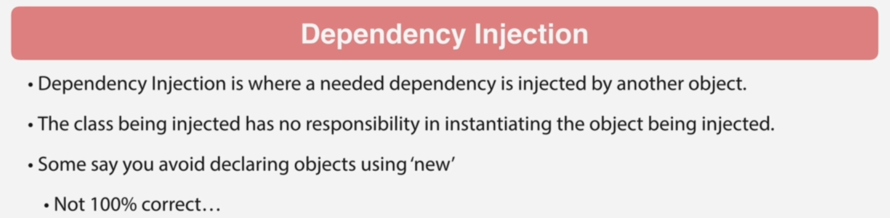
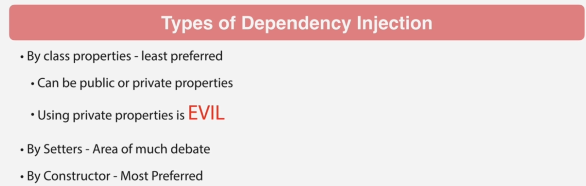
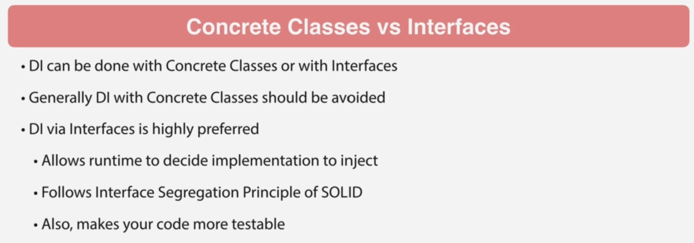
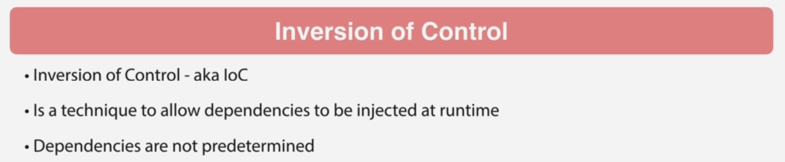
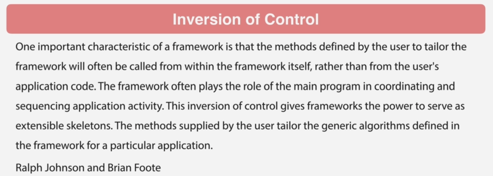
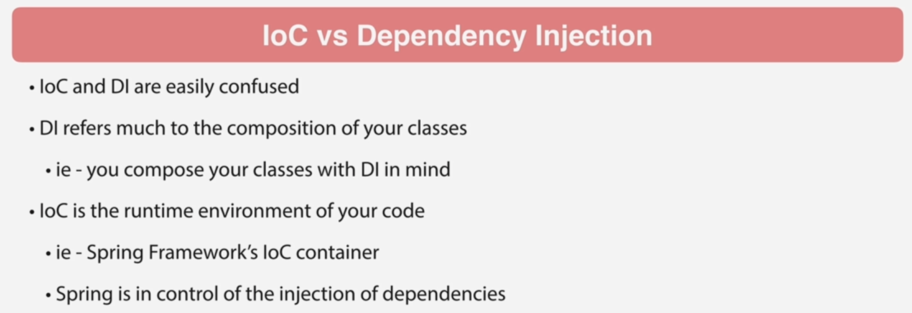
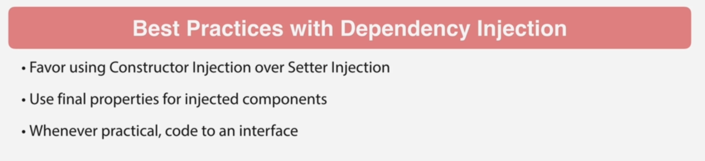

## Dependency Injection without Spring

let's create a interface for GreetingService

```java
package chamara.springdi.springdi.services;

public interface GreetingService {
    String sayGreeting();
}

```

then create a implementation for that

```java
package chamara.springdi.springdi.services;

public class GreetingServiceImpl implements GreetingService {
    @Override
    public String sayGreeting() {
        return "Hello World";
    }
}
```

let's first create the least preferred method.
using property injected method.

```java
package chamara.springdi.springdi.controllers;

import chamara.springdi.springdi.services.GreetingService;
import org.springframework.stereotype.Controller;

@Controller
public class PropertyInjectedController {
    public GreetingService greetingService;

    public String getGreeting(){
        return greetingService.sayGreeting();
    }
}

```

let's create a test for it.

```java
package chamara.springdi.springdi.controllers;

import chamara.springdi.springdi.services.GreetingServiceImpl;
import org.junit.jupiter.api.BeforeEach;
import org.junit.jupiter.api.Test;

import static org.junit.jupiter.api.Assertions.*;

class PropertyInjectedControllerTest {
    PropertyInjectedController controller;

    @BeforeEach
    void setup(){
        controller = new PropertyInjectedController();

        controller.greetingService = new GreetingServiceImpl();
    }

    @Test
    void getGreeting() {
        System.out.println(controller.getGreeting());
    }
}
```

output

```bash
Hello World
```

---

let's use the second method using setters Injected Controller

```java
package chamara.springdi.springdi.controllers;

import chamara.springdi.springdi.services.GreetingService;

public class SetterInjectedController {
    private GreetingService greetingService;

    public String getGreeting() {
        return this.greetingService.sayGreeting();
    }

    public void setGreeting(GreetingService greetingService) {
        this.greetingService = greetingService;
    }
}

```

and write the test for it

```java
package chamara.springdi.springdi.controllers;

import chamara.springdi.springdi.services.GreetingServiceImpl;
import org.junit.jupiter.api.BeforeEach;
import org.junit.jupiter.api.Test;

import static org.junit.jupiter.api.Assertions.*;

class SetterInjectedControllerTest {
    SetterInjectedController controller;
    @BeforeEach
    void setUp() {
        controller = new SetterInjectedController();
        controller.setGreeting(new GreetingServiceImpl());
    }

    @Test
    void getGreetingService() {
        System.out.println(controller.getGreeting());
    }
}
```

output

```bash
Hello World
```

---

now let's try the most preferred way using constructors

```java
package chamara.springdi.springdi.controllers;

import chamara.springdi.springdi.services.GreetingService;

public class ConstructorInjectedController {
    private final GreetingService greetingService;

    public ConstructorInjectedController(GreetingService greetingService) {
        this.greetingService = greetingService;
    }

    public String getGreeting() {
        return greetingService.sayGreeting();
    }
}

```

and write the test for it

```java
package chamara.springdi.springdi.controllers;

import chamara.springdi.springdi.services.GreetingServiceImpl;
import org.junit.jupiter.api.BeforeEach;
import org.junit.jupiter.api.Test;

import static org.junit.jupiter.api.Assertions.*;

class ConstructorInjectedControllerTest {

    ConstructorInjectedController controller;
    @BeforeEach
    void setUp() {
        controller = new ConstructorInjectedController(new GreetingServiceImpl());
    }

    @Test
    void getGreeting() {
        System.out.println(controller.getGreeting());
    }
}
```

output

```bash
Hello World
```

## Dependency Injection using Spring Framework

let's add the three ways we can inject dependencies in spring

```java
package chamara.springdi.springdi;

import chamara.springdi.springdi.controllers.ConstructorInjectedController;
import chamara.springdi.springdi.controllers.MyController;
import chamara.springdi.springdi.controllers.PropertyInjectedController;
import chamara.springdi.springdi.controllers.SetterInjectedController;
import org.springframework.boot.SpringApplication;
import org.springframework.boot.autoconfigure.SpringBootApplication;
import org.springframework.context.ApplicationContext;

@SpringBootApplication
public class SpringDiEApplication {

    public static void main(String[] args) {
        ApplicationContext ctx = SpringApplication.run(SpringDiEApplication.class, args);

        MyController myController = (MyController) ctx.getBean("myController");

        String greeting = myController.helloWorld();

        System.out.println(greeting);

        System.out.println("--------- START PROPERTY ------------------");
        PropertyInjectedController propertyInjectedController = (PropertyInjectedController) ctx.getBean("propertyInjectedController");
        System.out.println(propertyInjectedController.getGreeting());
        System.out.println("--------- END PROPERTY ------------------");

        System.out.println("--------- START SETTER ------------------");
        SetterInjectedController setterInjectedController = (SetterInjectedController) ctx.getBean("setterInjectedController");
        System.out.println(setterInjectedController.getGreeting());
        System.out.println("--------- END SETTER ------------------");

        System.out.println("--------- START CONSTRUCTOR ------------------");
        ConstructorInjectedController constructorInjectedController = (ConstructorInjectedController) ctx.getBean("constructorInjectedController");
        System.out.println(constructorInjectedController.getGreeting());
        System.out.println("--------- END CONSTRUCTOR ------------------");
    }

}

```

Start With Property
we have to add the @Autowired to explicitly tell Spring to manage the DI

```java
package chamara.springdi.springdi.controllers;

import chamara.springdi.springdi.services.GreetingService;
import org.springframework.beans.factory.annotation.Autowired;
import org.springframework.stereotype.Controller;

@Controller
public class PropertyInjectedController {
    @Autowired
    public GreetingService greetingService;

    public String getGreeting() {
        return greetingService.sayGreeting();
    }
}

```

in the service we have to tell Spring to manage the Service

```java
package chamara.springdi.springdi.services;

import org.springframework.stereotype.Service;

@Service
public class GreetingServiceImpl implements GreetingService {
    @Override
    public String sayGreeting() {
        return "Hello World";
    }
}

```

now let's check the Setter method.
we have to use the @Autowired and @Controller stereotypes.

```java
package chamara.springdi.springdi.controllers;

import chamara.springdi.springdi.services.GreetingService;
import org.springframework.beans.factory.annotation.Autowired;
import org.springframework.stereotype.Controller;

@Controller
public class SetterInjectedController {
    private GreetingService greetingService;

    public String getGreeting() {
        return this.greetingService.sayGreeting();
    }

    @Autowired
    public void setGreeting(GreetingService greetingService) {
        this.greetingService = greetingService;
    }
}

```

In the Constructor method we only have to add the @Controller stereotype. because Spring do the DI automatically

```java
package chamara.springdi.springdi.controllers;

import chamara.springdi.springdi.services.GreetingService;
import org.springframework.stereotype.Controller;

@Controller
public class ConstructorInjectedController {
    private final GreetingService greetingService;

    public ConstructorInjectedController(GreetingService greetingService) {
        this.greetingService = greetingService;
    }

    public String getGreeting() {
        return greetingService.sayGreeting();
    }
}

```

output

```bash
--------- START PROPERTY ------------------
Hello World
--------- END PROPERTY ------------------
--------- START SETTER ------------------
Hello World
--------- END SETTER ------------------
--------- START CONSTRUCTOR ------------------
Hello World
--------- END CONSTRUCTOR ------------------
```

## Using Qualifiers

let's create separate Services for each Type Of dependency injections.

PropertyInjectedGreetingService

```java
package chamara.springdi.springdi.services;

import org.springframework.stereotype.Service;

@Service
public class PropertyInjectedGreetingService implements GreetingService {
    @Override
    public String sayGreeting() {
        return "Hello World - Property";
    }
}

```

SetterInjectedGreetingService

```java
package chamara.springdi.springdi.services;

import org.springframework.stereotype.Service;

@Service
public class SetterInjectedGreetingService implements GreetingService {
    @Override
    public String sayGreeting() {
        return "Hello World - Setter";
    }
}

```

ConstructorGreetingService

```java
package chamara.springdi.springdi.services;

import org.springframework.stereotype.Service;

@Service
public class ConstructorGreetingService implements GreetingService {
    @Override
    public String sayGreeting() {
        return "Hello World - Constructor";
    }
}

```

let's add @Qualifier to let spring know which service to Implement

ConstructorInjectedController

```java
package chamara.springdi.springdi.controllers;

import chamara.springdi.springdi.services.GreetingService;
import org.springframework.beans.factory.annotation.Qualifier;
import org.springframework.stereotype.Controller;

@Controller
public class ConstructorInjectedController {
    private final GreetingService greetingService;

    public ConstructorInjectedController(@Qualifier("constructorGreetingService") GreetingService greetingService) {
        this.greetingService = greetingService;
    }

    public String getGreeting() {
        return greetingService.sayGreeting();
    }
}

```

PropertyInjectedController

```java
package chamara.springdi.springdi.controllers;

import chamara.springdi.springdi.services.GreetingService;
import org.springframework.beans.factory.annotation.Autowired;
import org.springframework.beans.factory.annotation.Qualifier;
import org.springframework.stereotype.Controller;

@Controller
public class PropertyInjectedController {
    @Qualifier("propertyInjectedGreetingService")
    @Autowired
    public GreetingService greetingService;

    public String getGreeting() {
        return greetingService.sayGreeting();
    }
}

```

SetterInjectedController

```java
package chamara.springdi.springdi.controllers;

import chamara.springdi.springdi.services.GreetingService;
import org.springframework.beans.factory.annotation.Autowired;
import org.springframework.beans.factory.annotation.Qualifier;
import org.springframework.stereotype.Controller;

@Controller
public class SetterInjectedController {
    private GreetingService greetingService;

    public String getGreeting() {
        return this.greetingService.sayGreeting();
    }

    @Autowired
    public void setGreeting(@Qualifier("setterInjectedGreetingService") GreetingService greetingService) {
        this.greetingService = greetingService;
    }
}

```

output

```bash
--------- START PROPERTY ------------------
Hello World - Property
--------- END PROPERTY ------------------
--------- START SETTER ------------------
Hello World - Setter
--------- END SETTER ------------------
--------- START CONSTRUCTOR ------------------
Hello World - Constructor
--------- END CONSTRUCTOR ------------------
```

## Primary Beans

let's create a PrimaryGreetingService with @Primary context annotation

```java
package chamara.springdi.springdi.services;

import org.springframework.context.annotation.Primary;
import org.springframework.stereotype.Service;

@Primary
@Service
public class PrimaryGreetingService implements GreetingService {
    @Override
    public String sayGreeting() {
        return "Hello World from Primary Bean ";
    }
}

```

let's change the MyController to use the Constructor DI

```java
package chamara.springdi.springdi.controllers;

import chamara.springdi.springdi.services.GreetingService;
import org.springframework.stereotype.Controller;

@Controller
public class MyController {
    private final GreetingService greetingService;

    public MyController(GreetingService greetingService) {
        this.greetingService = greetingService;
    }

    public String sayHello() {
        return greetingService.sayGreeting();
    }
}

```

And Call it inside the Main Method

```java
 public static void main(String[] args) {
        ApplicationContext ctx = SpringApplication.run(SpringDiEApplication.class, args);

        System.out.println("--------- START PRIMARY BEAN ------------------");
        MyController myController = (MyController) ctx.getBean("myController");
        System.out.println(myController.sayHello());
        System.out.println("--------- END PRIMARY BEAN ------------------");

```

```bash
--------- START PRIMARY BEAN ------------------
Hello World from Primary Bean
--------- END PRIMARY BEAN ------------------
```

## Spring Profiles

let's create a new controllers

I18nSpanishGreetingService

```java
package chamara.springdi.springdi.services;

import org.springframework.context.annotation.Profile;
import org.springframework.stereotype.Service;

@Profile("SP")
@Service("i18nService")
public class I18nSpanishGreetingService implements GreetingService {
    @Override
    public String sayGreeting() {
        return "Hola mundo";
    }
}
```

I18nEnglishGreetingService

```java
package chamara.springdi.springdi.services;

import org.springframework.context.annotation.Profile;
import org.springframework.stereotype.Service;

@Profile("EN")
@Service("i18nService")
public class I18nEnglishGreetingService implements GreetingService {
    @Override
    public String sayGreeting() {
        return "Hello World - English";
    }
}

```

I18nController

```java
package chamara.springdi.springdi.controllers;

import chamara.springdi.springdi.services.GreetingService;
import org.springframework.beans.factory.annotation.Qualifier;
import org.springframework.stereotype.Controller;

@Controller
public class I18nController {
    private final GreetingService greetingService;

    public I18nController(@Qualifier("i18nService") GreetingService greetingService) {
        this.greetingService = greetingService;
    }

    public String syaHello() {
        return greetingService.sayGreeting();
    }
}

```

application.properties

```ENV
spring.profiles.active=EN
```

SpringDiEApplication

```java
package chamara.springdi.springdi;

import chamara.springdi.springdi.controllers.*;
import org.springframework.boot.SpringApplication;
import org.springframework.boot.autoconfigure.SpringBootApplication;
import org.springframework.context.ApplicationContext;

@SpringBootApplication
public class SpringDiEApplication {

    public static void main(String[] args) {
        ApplicationContext ctx = SpringApplication.run(SpringDiEApplication.class, args);

        I18nController i18nController = (I18nController) ctx.getBean("i18nController");
        System.out.println(i18nController.syaHello());


```

Output```java

````

```bash
Hello World - English
````

## Default Profile

in side the services we can provide the default value to set that service as the default profile.

I18nEnglishGreetingService

```java
@Profile({"EN", "default"})
@Service("i18nService")
public class I18nEnglishGreetingService implements GreetingService {
    @Override
    public String sayGreeting() {
        return "Hello World - English";
    }
}

```

comment out the active profile

application.properties

```env
#spring.profiles.active=EN
```

output

```bash
Hello World - English
```

## Spring Bean Life Cycle

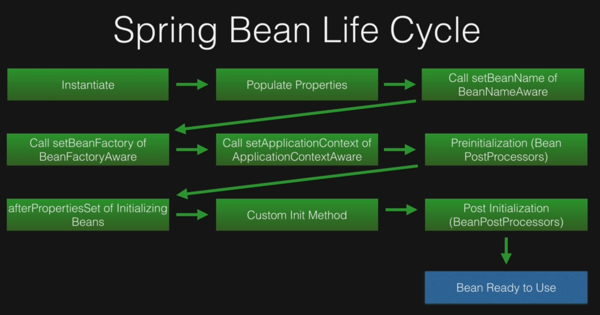
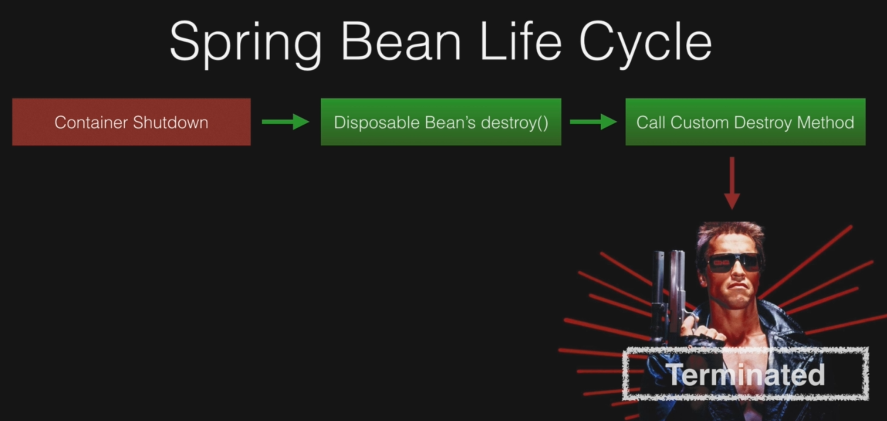
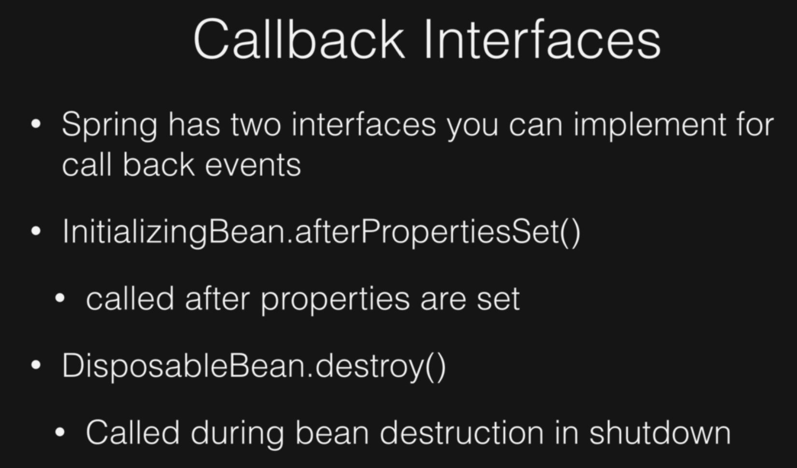
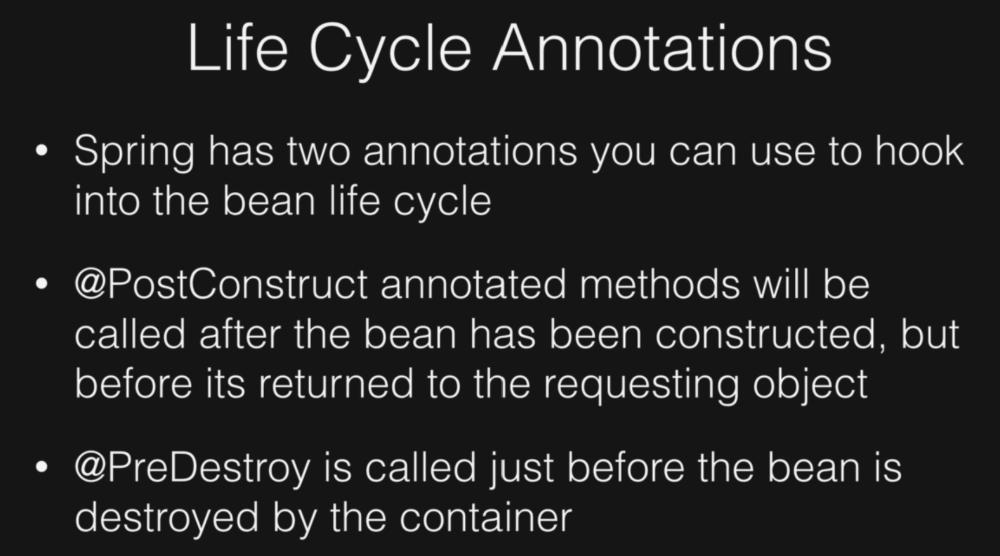
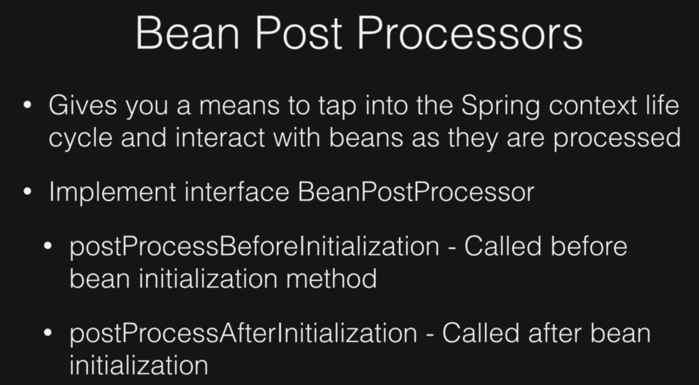
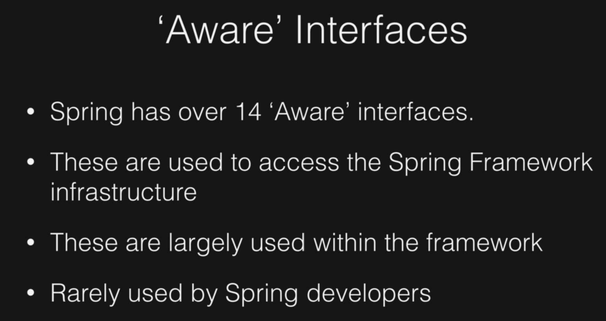
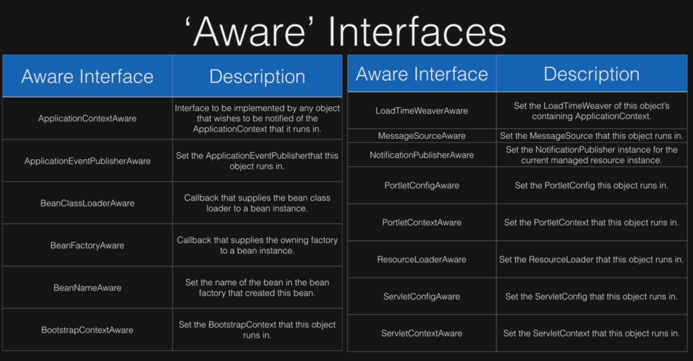

## Questions

Interface
PetService

```java
package chamara.springdi.springdi.services;

public interface PetService {
    String GetPetType();
}

```

Service
CatPetService

```java
package chamara.springdi.springdi.services;

import org.springframework.context.annotation.Profile;
import org.springframework.stereotype.Service;

@Service
@Profile("cat")
public class CatPetService implements PetService {
    @Override
    public String GetPetType() {
        return "Cats Are the Best!";
    }
}
```

PetController

```java
package chamara.springdi.springdi.controllers;

import chamara.springdi.springdi.services.PetService;
import org.springframework.stereotype.Controller;

@Controller
public class PetController {
    private final PetService petService;

    public PetController(PetService petService) {
        this.petService = petService;
    }

    public String whichPetIsTheBest() {
        return petService.GetPetType();
    }
}

```

add the cat profile

```ENV
spring.profiles.active=cat,EN
```

Run The Code

```java
package chamara.springdi.springdi;

import chamara.springdi.springdi.controllers.*;
import org.springframework.boot.SpringApplication;
import org.springframework.boot.autoconfigure.SpringBootApplication;
import org.springframework.context.ApplicationContext;

@SpringBootApplication
public class SpringDiEApplication {

    public static void main(String[] args) {
        ApplicationContext ctx = SpringApplication.run(SpringDiEApplication.class, args);


        System.out.println("--------- START PET SERVICE ------------------");
        PetController petController = (PetController) ctx.getBean("petController", PetController.class);
        System.out.println(petController.whichPetIsTheBest());
        System.out.println("--------- END PET SERVICE ------------------");

```

output

```bash
--------- START PET SERVICE ------------------
Cats Are the Best!
--------- END PET SERVICE ------------------
```

## Spring Bean Life Cycle Demo

LifeCycleDemoBean

```java
package chamara.springdi.springdi.services;

import org.springframework.beans.BeansException;
import org.springframework.beans.factory.*;
import org.springframework.context.ApplicationContext;
import org.springframework.context.ApplicationContextAware;
import org.springframework.stereotype.Component;

import javax.annotation.PostConstruct;
import javax.annotation.PreDestroy;

@Component
public class LifeCycleDemoBean implements InitializingBean, DisposableBean, BeanNameAware,
        BeanFactoryAware, ApplicationContextAware {
    public LifeCycleDemoBean() {
        System.out.println("## I'm in the LifeCycleBean Constructor");
    }

    @Override
    public void destroy() throws Exception {
        System.out.println("## The Lifecycle bean has been terminated");

    }

    @Override
    public void afterPropertiesSet() throws Exception {
        System.out.println("## The LifeCycleBean has its properties set!");

    }

    @Override
    public void setBeanFactory(BeanFactory beanFactory) throws BeansException {
        System.out.println("## Bean Factory has been set");
    }

    @Override
    public void setBeanName(String name) {
        System.out.println("## My Bean Name is: " + name);

    }

    @Override
    public void setApplicationContext(ApplicationContext applicationContext) throws BeansException {
        System.out.println("## Application context has been set");
    }

    @PostConstruct
    public void postConstruct() {
        System.out.println("## The Post Construct annotated method has been called");
    }

    @PreDestroy
    public void preDestroy() {
        System.out.println("## The Predestroy annotated method has been called");
    }

    public void beforeInit() {
        System.out.println("## - Before Init - Called by Bean Post Processor");
    }

    public void afterInit() {
        System.out.println("## - After init called by Bean Post Processor");
    }
}

```

CustomBeanPostProcessor

```java
package chamara.springdi.springdi.services;

import org.springframework.beans.BeansException;
import org.springframework.beans.factory.config.BeanPostProcessor;
import org.springframework.stereotype.Component;

@Component
public class CustomBeanPostProcessor implements BeanPostProcessor {
    @Override
    public Object postProcessBeforeInitialization(Object bean, String beanName) throws BeansException {

        if (bean instanceof LifeCycleDemoBean) {
            ((LifeCycleDemoBean) bean).beforeInit();
        }

        return bean;
    }

    @Override
    public Object postProcessAfterInitialization(Object bean, String beanName) throws BeansException {
        if (bean instanceof LifeCycleDemoBean) {
            ((LifeCycleDemoBean) bean).afterInit();
        }

        return bean;
    }
}

```

DogPetService

```java
package chamara.springdi.springdi.services;

import org.springframework.context.annotation.Profile;
import org.springframework.stereotype.Service;

@Profile({"dog", "default"})
@Service
public class DogPetService implements PetService {
    @Override
    public String GetPetType() {
        return "Dogs are the best!";
    }
}

```

SpringDiEApplication

```java
package chamara.springdi.springdi;

import chamara.springdi.springdi.controllers.*;
import chamara.springdi.springdi.services.LifeCycleDemoBean;
import org.springframework.boot.SpringApplication;
import org.springframework.boot.autoconfigure.SpringBootApplication;
import org.springframework.context.ApplicationContext;

@SpringBootApplication
public class SpringDiEApplication {

    public static void main(String[] args) {
        ApplicationContext ctx = SpringApplication.run(SpringDiEApplication.class, args);

        LifeCycleDemoBean lifeCycleDemoBean = (LifeCycleDemoBean) ctx.getBean("lifeCycleDemoBean");
        System.out.println("--------- START PET SERVICE ------------------");
        PetController petController = (PetController) ctx.getBean("petController", PetController.class);
        System.out.println(petController.whichPetIsTheBest());
        System.out.println("--------- END PET SERVICE ------------------");

        System.out.println("--------- START DEFAULT PROFILE ------------------");
        I18nController i18nController = (I18nController) ctx.getBean("i18nController");
        System.out.println(i18nController.syaHello());
        System.out.println("--------- END DEFAULT PROFILE ------------------");

        System.out.println("--------- START PRIMARY BEAN ------------------");
        MyController myController = (MyController) ctx.getBean("myController");
        System.out.println(myController.sayHello());
        System.out.println("--------- END PRIMARY BEAN ------------------");


        System.out.println("--------- START PROPERTY ------------------");
        PropertyInjectedController propertyInjectedController = (PropertyInjectedController) ctx.getBean("propertyInjectedController");
        System.out.println(propertyInjectedController.getGreeting());
        System.out.println("--------- END PROPERTY ------------------");

        System.out.println("--------- START SETTER ------------------");
        SetterInjectedController setterInjectedController = (SetterInjectedController) ctx.getBean("setterInjectedController");
        System.out.println(setterInjectedController.getGreeting());
        System.out.println("--------- END SETTER ------------------");

        System.out.println("--------- START CONSTRUCTOR ------------------");
        ConstructorInjectedController constructorInjectedController = (ConstructorInjectedController) ctx.getBean("constructorInjectedController");
        System.out.println(constructorInjectedController.getGreeting());
        System.out.println("--------- END CONSTRUCTOR ------------------");
    }

}

```

output

```bash
## I'm in the LifeCycleBean Constructor
## My Bean Name is: lifeCycleDemoBean
## Bean Factory has been set
## Application context has been set
## - Before Init - Called by Bean Post Processor
## The Post Construct annotated method has been called
## The LifeCycleBean has its properties set!
## - After init called by Bean Post Processor
2022-09-20 08:35:01.460  INFO 21640 --- [           main] c.s.springdi.SpringDiEApplication        : Started SpringDiEApplication in 0.78 seconds (JVM running for 1.226)
--------- START PET SERVICE ------------------
Cats Are the Best!
--------- END PET SERVICE ------------------
--------- START DEFAULT PROFILE ------------------
Hello World - English
--------- END DEFAULT PROFILE ------------------
--------- START PRIMARY BEAN ------------------
Hello World from Primary Bean
--------- END PRIMARY BEAN ------------------
--------- START PROPERTY ------------------
Hello World - Property
--------- END PROPERTY ------------------
--------- START SETTER ------------------
Hello World - Setter
--------- END SETTER ------------------
--------- START CONSTRUCTOR ------------------
Hello World - Constructor
--------- END CONSTRUCTOR ------------------
## The Predestroy annotated method has been called
## The Lifecycle bean has been terminated
```

## Flashcards

---

question

answer

---


question

answer


---

question

answer


---

---

question


answer


---

---

question

answer


---

question

answer


---

question

answer


---

question


---

question

answer


---

question

answer


---

question

answer


---

question

answer


---

question

answer


---

question

answer


## Open Closed Principle

As applications evolve, changes are required. Changes are required when a new functionality is added or an existing functionality is updated in the application. Often in both situations, you need to modify the existing code, and that carries the risk of breaking the application’s functionality. For good application design and the code writing part, you should avoid change in the existing code when requirements change. Instead, you should extend the existing functionality by adding new code to meet the new requirements. You can achieve this by following the Open Closed Principle.

The Open Closed Principle represents the “O” of the five SOLID software engineering principles to write well-designed code that are more readable, maintainable, and easier to upgrade and modify. Bertrand Meyer coined the term Open Closed Principle, which first appeared in his book Object-Oriented Software Construction, release in 1988. This was about eight years before the initial release of Java.

This principle states: “software entities (classes, modules, functions, etc.) should be open for extension, but closed for modification “. Let’s zero in on the two key phrases of the statement:

```
    “Open for extension “: This means that the behavior of a software module, say a class can be extended to make it behave in new and different ways. It is important to note here that the term “extended ” is not limited to inheritance using the Java extend keyword. As mentioned earlier, Java did not exist at that time. What it means here is that a module should provide extension points to alter its behavior. One way is to make use of polymorphism to invoke extended behaviors of an object at run time.

    “Closed for modification “: This means that the source code of such a module remains unchanged.
```

It might initially appear that the phrases are conflicting- How can we change the behavior of a module without making changes to it? The answer in Java is abstraction. You can create abstractions (Java interfaces and abstract classes) that are fixed and yet represent an unbounded group of possible behaviors through concrete subclasses.

Before we write code which follows the Open Closed Principle, let’s look at the consequences of violating the Open Closed principle.

Open Closed Principle Violation (Bad Example)

Consider an insurance system that validates health insurance claims before approving one. We can follow the complementary Single Responsibility Principle to model this requirement by creating two separate classes. A HealthInsuranceSurveyor class responsible to validate claims and a ClaimApprovalManager class responsible to approve claims.

**HealthInsuranceSurveyor.java**

```java
package guru.springframework.blog.openclosedprinciple;
public class HealthInsuranceSurveyor{
    public boolean isValidClaim(){
        System.out.println("HealthInsuranceSurveyor: Validating health insurance claim...");
        /*Logic to validate health insurance claims*/
        return true;
    }
}

```

**ClaimApprovalManager.java**

```java
package guru.springframework.blog.openclosedprinciple;
public class ClaimApprovalManager {
    public void processHealthClaim (HealthInsuranceSurveyor surveyor)    {
        if(surveyor.isValidClaim()){
            System.out.println("ClaimApprovalManager: Valid claim. Currently processing claim for approval....");
        }
    }
}

```

Both the HealthInsuranceSurveyor and ClaimApprovalManager classes work fine and the design for the insurance system appears perfect until a new requirement to process vehicle insurance claims arises. We now need to include a new VehicleInsuranceSurveyor class, and this should not create any problems. But, what we also need is to modify the ClaimApprovalManager class to process vehicle insurance claims. This is how the modified ClaimApprovalManager will be:
Modified

**ClaimApprovalManager.java**

```java
package guru.springframework.blog.openclosedprinciple;
    public class ClaimApprovalManager {
        public void processHealthClaim (HealthInsuranceSurveyor surveyor) {
            if(surveyor.isValidClaim()){
                System.out.println("ClaimApprovalManager: Valid claim. Currently processing claim for approval....");
            }
    }
    public void processVehicleClaim (VehicleInsuranceSurveyor surveyor) {
        if(surveyor.isValidClaim()){
            System.out.println("ClaimApprovalManager: Valid claim. Currently processing claim for approval....");
        }
    }
}
```

In the example above, we modified the ClaimApprovalManager class by adding a new processVehicleClaim( ) method to incorporate a new functionality (claim approval of vehicle insurance).

As apparent, this is a clear violation of the Open Closed Principle. We need to modify the class to add support for a new functionality. In fact, we violated the Open Closed Principle at the very first instance we wrote the ClaimApprovalManager class. This may appear innocuous in the current example, but consider the consequences in an enterprise application that needs to keep pace with fast changing business demands. For each change, you need to modify, test, and deploy the entire application. That not only makes the application fragile and expensive to extend but also makes it prone to software bugs.
Coding to the Open Closed Principle

The ideal approach for the insurance claim example would have been to design the ClaimApprovalManager class in a way that it remains:

- Open to support more types of insurance claims.
- Closed for any modifications whenever support for a new type of claim is added.

To achieve this, let’s introduce a layer of abstraction by creating an abstract class to represent different claim validation behaviors. We will name the class InsuranceSurveyor.

**InsuranceSurveyor.java**

```java
package guru.springframework.blog.openclosedprinciple;


public abstract class InsuranceSurveyor {
    public abstract boolean isValidClaim();
}

```

Next, we will write the specific classes for each type of claim validation.
**HealthInsuranceSurveyor.java**

```java
package guru.springframework.blog.openclosedprinciple;
public class HealthInsuranceSurveyor extends InsuranceSurveyor{
    public boolean isValidClaim(){
        System.out.println("HealthInsuranceSurveyor: Validating health insurance claim...");
        /*Logic to validate health insurance claims*/
        return true;
    }
}
```

**VehicleInsuranceSurveyor.java**

```java
package guru.springframework.blog.openclosedprinciple;
public class VehicleInsuranceSurveyor extends InsuranceSurveyor{
    public boolean isValidClaim(){
       System.out.println("VehicleInsuranceSurveyor: Validating vehicle insurance claim...");
        /*Logic to validate vehicle insurance claims*/
        return true;
    }
}
```

In the examples above, we wrote the HealthInsuranceSurveyor and VehicleInsuranceSurveyor classes that extend the abstract InsuranceSurveyor class. Both classes provide different implementations of the isValidClaim( ) method. We will now write the ClaimApprovalManager class to follow the Open/Closed Principle.

**ClaimApprovalManager.java**

```java
package guru.springframework.blog.openclosedprinciple;
public class ClaimApprovalManager {
    public void processClaim(InsuranceSurveyor surveyor){
        if(surveyor.isValidClaim()){
            System.out.println("ClaimApprovalManager: Valid claim. Currently processing claim for approval....");
        }
    }
}
```

In the example above, we wrote a processClaim( ) method to accept a InsuranceSurveyor type instead of specifying a concrete type. In this way, any further addition of InsuranceSurveyor implementations will not affect the ClaimApprovalManager class. Our insurance system is now open to support more types of insurance claims, and closed for any modifications whenever a new claim type is added. To test our example, let’s write this unit test.

**ClaimApprovalManagerTest.java**

```java
package guru.springframework.blog.openclosedprinciple;

import org.junit.Test;
import static org.junit.Assert.*;

public class ClaimApprovalManagerTest {

    @Test
    public void testProcessClaim() throws Exception {
      HealthInsuranceSurveyor healthInsuranceSurveyor = new HealthInsuranceSurveyor();

      ClaimApprovalManager claim1 = new ClaimApprovalManager();

      claim1.processClaim(healthInsuranceSurveyor);

      VehicleInsuranceSurveyor vehicleInsuranceSurveyor = new VehicleInsuranceSurveyor();

      ClaimApprovalManager claim2 = new ClaimApprovalManager();

      claim2.processClaim(vehicleInsuranceSurveyor);
    }
}
```

The output is:

```bash

. \_**\_ \_** \_ \_
/\\ / **_'_** \_ _(_)_\_\_ \_\__ \ \ \ \
( ( )\_**| '_ | '_| | '_ \/ _` | \ \ \ \
 \\/ \_**)| |_)| | | | | || (_| | ) ) ) )
' |\_**\_| .**|_| |_|_| |_\__, | / / / /
=========|_|==============|_\_\_/=/_/_/_/
:: Spring Boot :: (v1.2.3.RELEASE)

Running guru.springframework.blog.openclosedprinciple.ClaimApprovalManagerTest
HealthInsuranceSurveyor: Validating health insurance claim...
ClaimApprovalManager: Valid claim. Currently processing claim for approval....
VehicleInsuranceSurveyor: Validating vehicle insurance claim...
ClaimApprovalManager: Valid claim. Currently processing claim for approval....
Tests run: 1, Failures: 0, Errors: 0, Skipped: 0, Time elapsed: 0.001 sec - in guru.springframework.blog.openclosedprinciple.ClaimApprovalManagerTest
```

**Summary**

Most of the times real closure of a software entity is practically not possible because there is always a chance that a change will violate the closure. For example, in our insurance example a change in the business rule to process a specific type of claim will require modifying the ClaimApprovalManager class. So, during enterprise application development, even if you might not always manage to write code that satisfies the Open Closed Principle in every aspect, taking the steps towards it will be beneficial as the application evolves.
Get The Code

## Interface Segregation Principle

to be added

## Dependency Inversion Principle

to be added

## Interface Naming Conventions

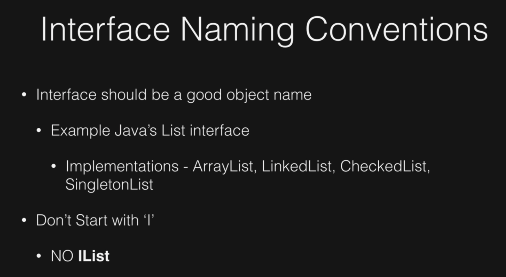
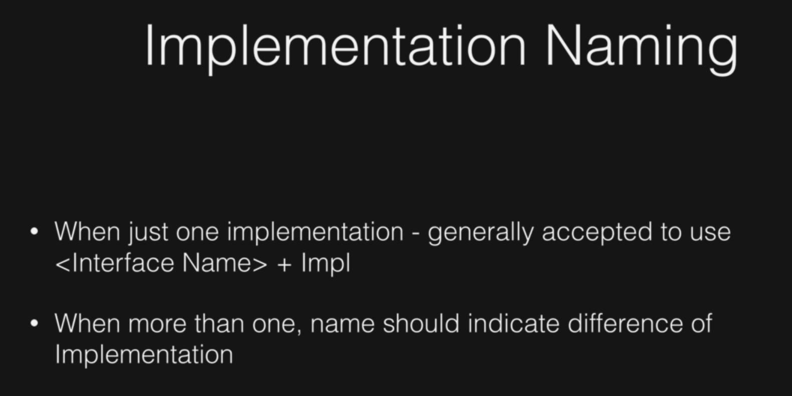

## Spring Pet Clinic - POJO Data Model

let's create POJOs for

- Owner
- Person
- Pet
- PetType
- Vet

**Person**

```java
package chamara.springframework.springpetclinic.model;

public class Person {
    private String firstName;
    private String lastName;

    public String getFirstName() {
        return firstName;
    }

    public void setFirstName(String firstName) {
        this.firstName = firstName;
    }

    public String getLastName() {
        return lastName;
    }

    public void setLastName(String lastName) {
        this.lastName = lastName;
    }
}
```

**Owner**

```java
package chamara.springframework.springpetclinic.model;

public class Owner extends Person{
}
```

**Vet**

```java
package chamara.springframework.springpetclinic.model;

public class Vet extends Person {

}
```

**Pet**

```java
package chamara.springframework.springpetclinic.model;

import java.time.LocalDate;

public class Pet {
    private PetType petType;
    private Owner owner;
    private LocalDate birthDate;

    public PetType getPetType() {
        return petType;
    }

    public void setPetType(PetType petType) {
        this.petType = petType;
    }

    public Owner getOwner() {
        return owner;
    }

    public void setOwner(Owner owner) {
        this.owner = owner;
    }

    public LocalDate getBirthDate() {
        return birthDate;
    }

    public void setBirthDate(LocalDate birthDate) {
        this.birthDate = birthDate;
    }
}
```

**PetType**

```java
package chamara.springframework.springpetclinic.model;

public class PetType {
    private String name;

    public String getName() {
        return name;
    }

    public void setName(String name) {
        this.name = name;
    }
}
```

```java
```

## Spring Pet Clinic - Multi-Module Maven Builds

let's create two modules for the data and web.

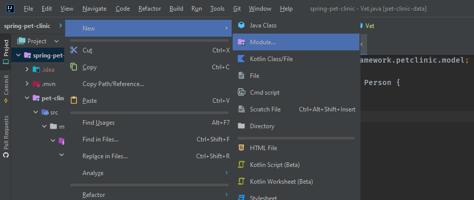

after creating the modules.

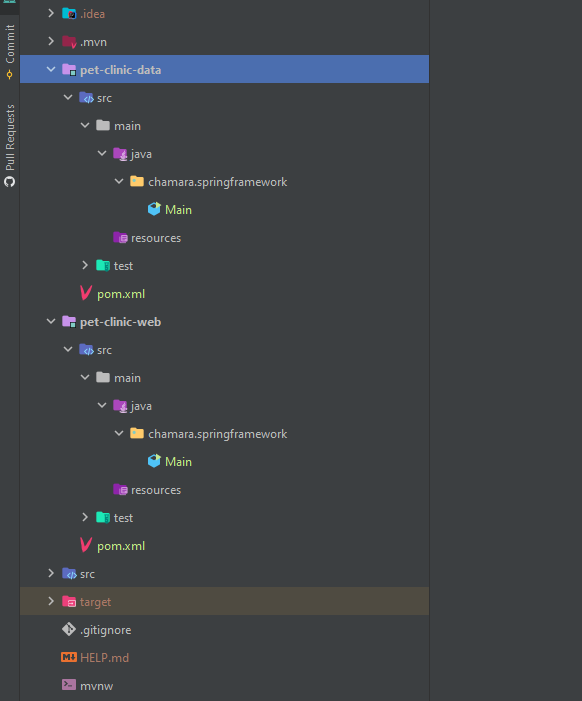

let's move the files to data module

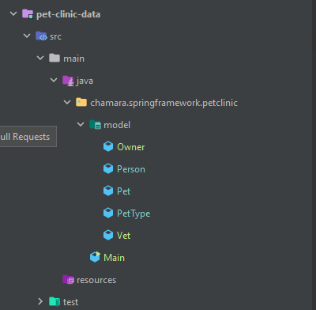

let's move the application files to the web module.

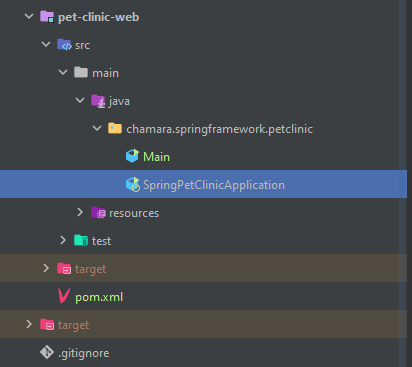

let's move the dependencies to related modules.

data module
we adding the build part to not to repackage

```xml
<?xml version="1.0" encoding="UTF-8"?>
<project xmlns="http://maven.apache.org/POM/4.0.0"
         xmlns:xsi="http://www.w3.org/2001/XMLSchema-instance"
         xsi:schemaLocation="http://maven.apache.org/POM/4.0.0 http://maven.apache.org/xsd/maven-4.0.0.xsd">
    <parent>
        <artifactId>spring-pet-clinic</artifactId>
        <groupId>chamara.springframework</groupId>
        <version>0.0.1-SNAPSHOT</version>
    </parent>
    <modelVersion>4.0.0</modelVersion>

    <artifactId>pet-clinic-data</artifactId>

    <properties>
        <maven.compiler.source>17</maven.compiler.source>
        <maven.compiler.target>17</maven.compiler.target>
        <project.build.sourceEncoding>UTF-8</project.build.sourceEncoding>
    </properties>
    <dependencies>
        <dependency>
            <groupId>org.springframework.boot</groupId>
            <artifactId>spring-boot-starter-data-jpa</artifactId>
        </dependency>
        <dependency>
            <groupId>com.h2database</groupId>
            <artifactId>h2</artifactId>
            <scope>runtime</scope>
        </dependency>
        <dependency>
            <groupId>mysql</groupId>
            <artifactId>mysql-connector-java</artifactId>
            <scope>runtime</scope>
        </dependency>
        <dependency>
            <groupId>org.postgresql</groupId>
            <artifactId>postgresql</artifactId>
            <scope>runtime</scope>
        </dependency>
        <dependency>
            <groupId>org.projectlombok</groupId>
            <artifactId>lombok</artifactId>
            <optional>true</optional>
        </dependency>
        <dependency>
            <groupId>org.springframework.boot</groupId>
            <artifactId>spring-boot-starter-test</artifactId>
            <scope>test</scope>
        </dependency>
    </dependencies>
    <build>
        <plugins>
            <plugin>
                <groupId>org.springframework.boot</groupId>
                <artifactId>spring-boot-maven-plugin</artifactId>
                <executions>
                    <execution>
                        <goals>
                            <goal>repackage</goal>
                        </goals>
                        <configuration>
                            <skip>true</skip>
                        </configuration>
                    </execution>
                </executions>
                <configuration>
                    <excludes>
                        <exclude>
                            <groupId>org.projectlombok</groupId>
                            <artifactId>lombok</artifactId>
                        </exclude>
                    </excludes>
                </configuration>
            </plugin>
        </plugins>
    </build>
</project>
```

web module

```xml
<?xml version="1.0" encoding="UTF-8"?>
<project xmlns="http://maven.apache.org/POM/4.0.0"
         xmlns:xsi="http://www.w3.org/2001/XMLSchema-instance"
         xsi:schemaLocation="http://maven.apache.org/POM/4.0.0 http://maven.apache.org/xsd/maven-4.0.0.xsd">
    <parent>
        <artifactId>spring-pet-clinic</artifactId>
        <groupId>chamara.springframework</groupId>
        <version>0.0.1-SNAPSHOT</version>
    </parent>
    <modelVersion>4.0.0</modelVersion>

    <artifactId>pet-clinic-web</artifactId>

    <properties>
        <maven.compiler.source>17</maven.compiler.source>
        <maven.compiler.target>17</maven.compiler.target>
        <project.build.sourceEncoding>UTF-8</project.build.sourceEncoding>
    </properties>
    <dependencies>
        <dependency>
            <artifactId>pet-clinic-data</artifactId>
            <groupId>chamara.springframework</groupId>
            <version>0.0.1-SNAPSHOT</version>
        </dependency>
        <dependency>
            <groupId>org.springframework.boot</groupId>
            <artifactId>spring-boot-starter-actuator</artifactId>
        </dependency>
        <dependency>
            <groupId>org.springframework.boot</groupId>
            <artifactId>spring-boot-starter-thymeleaf</artifactId>
        </dependency>
        <dependency>
            <groupId>org.springframework.boot</groupId>
            <artifactId>spring-boot-starter-web</artifactId>
        </dependency>

        <dependency>
            <groupId>org.springframework.boot</groupId>
            <artifactId>spring-boot-devtools</artifactId>
            <scope>runtime</scope>
            <optional>true</optional>
        </dependency>

        <dependency>
            <groupId>org.springframework.boot</groupId>
            <artifactId>spring-boot-starter-test</artifactId>
            <scope>test</scope>
        </dependency>
    </dependencies>
</project>
```

pet clinic app

```xml
<?xml version="1.0" encoding="UTF-8"?>
<project xmlns="http://maven.apache.org/POM/4.0.0" xmlns:xsi="http://www.w3.org/2001/XMLSchema-instance"
         xsi:schemaLocation="http://maven.apache.org/POM/4.0.0 https://maven.apache.org/xsd/maven-4.0.0.xsd">
    <modelVersion>4.0.0</modelVersion>
    <packaging>pom</packaging>
    <modules>
        <module>pet-clinic-data</module>
        <module>pet-clinic-web</module>
    </modules>
    <parent>
        <groupId>org.springframework.boot</groupId>
        <artifactId>spring-boot-starter-parent</artifactId>
        <version>2.7.3</version>
        <relativePath/> <!-- lookup parent from repository -->
    </parent>
    <groupId>chamara.springframework</groupId>
    <artifactId>spring-pet-clinic</artifactId>
    <version>0.0.1-SNAPSHOT</version>
    <name>spring-pet-clinic</name>
    <description>spring-pet-clinic</description>
    <properties>
        <java.version>17</java.version>
    </properties>
    <build>
        <plugins>
            <plugin>
                <groupId>org.springframework.boot</groupId>
                <artifactId>spring-boot-maven-plugin</artifactId>
                <configuration>
                    <excludes>
                        <exclude>
                            <groupId>org.projectlombok</groupId>
                            <artifactId>lombok</artifactId>
                        </exclude>
                    </excludes>
                </configuration>
            </plugin>
        </plugins>
    </build>

</project>

```

## Spring Pet Clinic - Using the Maven Release Plugin

to the main app
add this plugin

```xml
            <plugin>
                <groupId>org.apache.maven.plugins</groupId>
                <artifactId>maven-release-plugin</artifactId>
                <configuration>
                    <goals>install</goals>
                    <autoVersionSubmodules>true</autoVersionSubmodules>
                </configuration>
            </plugin>
        </plugins>
    </build>
    <scm>
        <developerConnection>scm:git:git@github.com:ccweerasinghe1994/SpringBoot-Mastery.git</developerConnection>
      <tag>HEAD</tag>
  </scm>
</project>
```

 then run the

```bash
mvn release:prepare

mvn release:perform 

```

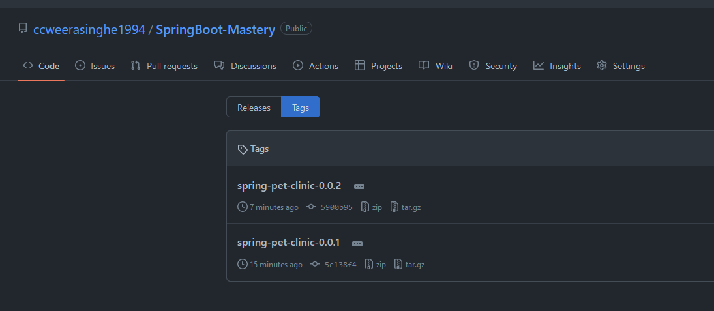

## Spring Pet Clinic - Create Interfaces for Services

let's create the interfaces for the

- Owner
- Pet
- Vet

**Owner**

```java
package chamara.springframework.petclinic.services;
import chamara.springframework.petclinic.model.Owner;
import java.util.Set;
public interface OwnerService {
    Owner findByLastName(String lastName);
    Owner findBiId(Long id);
    Owner save(Owner owner);
    Set<Owner> findAll();
}
```

**Pet**

```java
package chamara.springframework.petclinic.services;
import chamara.springframework.petclinic.model.Pet;
import java.util.Set;
public interface PetService {
    Pet findBiId(Long id);
    Pet save(Pet pet);
    Set<Pet> findAll();
}
```

**Vet**

```java
package chamara.springframework.petclinic.services;
import chamara.springframework.petclinic.model.Vet;
import java.util.Set;
public interface VetService {
    Vet findBiId(Long id);
    Vet save(Vet vet);
    Set<Vet> findAll();
}
```

## Spring Pet Clinic - Implement Base Entity
