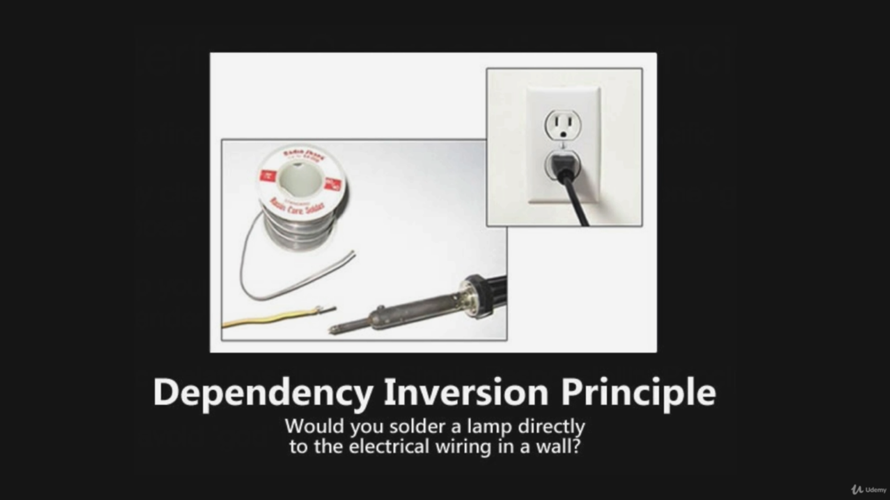

# Dependency Injection

## SOLID Principles of OOP





## Create Spring DI Example Project


## The Spring Context

run the app with the doc inside


create the controller

```java
package chamara.springdi.springdi.controllers;

import org.springframework.stereotype.Controller;

@Controller
public class MyController {
    public String helloWorld() {
        System.out.println("Hello World");
        return "Hi Folks";
    }
}

```

get the context

```java
package chamara.springdi.springdi;

import chamara.springdi.springdi.controllers.MyController;
import org.springframework.boot.SpringApplication;
import org.springframework.boot.autoconfigure.SpringBootApplication;
import org.springframework.context.ApplicationContext;

@SpringBootApplication
public class SpringDiEApplication {

    public static void main(String[] args) {
        ApplicationContext ctx = SpringApplication.run(SpringDiEApplication.class, args);

        MyController myController = (MyController) ctx.getBean("myController");

        String greeting = myController.helloWorld();

        System.out.println(greeting);
    }

}

```

## Basics of Dependency Injection


## Dependency Injection without Spring

let's create a interface for GreetingService

```java
package chamara.springdi.springdi.services;

public interface GreetingService {
    String sayGreeting();
}

```

then create a implementation for that

```java
package chamara.springdi.springdi.services;

public class GreetingServiceImpl implements GreetingService {
    @Override
    public String sayGreeting() {
        return "Hello World";
    }
}
```

let's first create the least preferred method.
using property injected method.

```java
package chamara.springdi.springdi.controllers;

import chamara.springdi.springdi.services.GreetingService;
import org.springframework.stereotype.Controller;

@Controller
public class PropertyInjectedController {
    public GreetingService greetingService;

    public String getGreeting(){
        return greetingService.sayGreeting();
    }
}

```

let's create a test for it.

```java
package chamara.springdi.springdi.controllers;

import chamara.springdi.springdi.services.GreetingServiceImpl;
import org.junit.jupiter.api.BeforeEach;
import org.junit.jupiter.api.Test;

import static org.junit.jupiter.api.Assertions.*;

class PropertyInjectedControllerTest {
    PropertyInjectedController controller;

    @BeforeEach
    void setup(){
        controller = new PropertyInjectedController();

        controller.greetingService = new GreetingServiceImpl();
    }

    @Test
    void getGreeting() {
        System.out.println(controller.getGreeting());
    }
}
```

output

```shell
Hello World
```

---

let's use the second method using setters Injected Controller

```java
package chamara.springdi.springdi.controllers;

import chamara.springdi.springdi.services.GreetingService;

public class SetterInjectedController {
    private GreetingService greetingService;

    public String getGreeting() {
        return this.greetingService.sayGreeting();
    }

    public void setGreeting(GreetingService greetingService) {
        this.greetingService = greetingService;
    }
}

```

and write the test for it

```java
package chamara.springdi.springdi.controllers;

import chamara.springdi.springdi.services.GreetingServiceImpl;
import org.junit.jupiter.api.BeforeEach;
import org.junit.jupiter.api.Test;

import static org.junit.jupiter.api.Assertions.*;

class SetterInjectedControllerTest {
    SetterInjectedController controller;
    @BeforeEach
    void setUp() {
        controller = new SetterInjectedController();
        controller.setGreeting(new GreetingServiceImpl());
    }

    @Test
    void getGreetingService() {
        System.out.println(controller.getGreeting());
    }
}
```

output

```shell
Hello World
```

---

now let's try the most preferred way using constructors

```java
package chamara.springdi.springdi.controllers;

import chamara.springdi.springdi.services.GreetingService;

public class ConstructorInjectedController {
    private final GreetingService greetingService;

    public ConstructorInjectedController(GreetingService greetingService) {
        this.greetingService = greetingService;
    }

    public String getGreeting() {
        return greetingService.sayGreeting();
    }
}

```

and write the test for it

```java
package chamara.springdi.springdi.controllers;

import chamara.springdi.springdi.services.GreetingServiceImpl;
import org.junit.jupiter.api.BeforeEach;
import org.junit.jupiter.api.Test;

import static org.junit.jupiter.api.Assertions.*;

class ConstructorInjectedControllerTest {

    ConstructorInjectedController controller;
    @BeforeEach
    void setUp() {
        controller = new ConstructorInjectedController(new GreetingServiceImpl());
    }

    @Test
    void getGreeting() {
        System.out.println(controller.getGreeting());
    }
}
```

output

```shell
Hello World
```

```java

```

```java

```

```java

```

```java

```

```java

```

```java

```

```java

```

output

```shell

```

output

```shell

```

## Dependency Injection using Spring Framework

## Using Qualifiers

## Primary Beans

## Spring Profiles

## Default Profile

## Dependency Injection Assignment

## Spring Bean Life Cycle

## Spring Bean Life Cycle Demo

## Flashcards

## Open Closed Principle

## Interface Segregation Principle

## Dependency Inversion Principle

## Interface Naming Conventions

## Spring Pet Clinic - POJO Data Model

## Spring Pet Clinic - Multi-Module Maven Builds

## Spring Pet Clinic - Using the Maven Release Plugin

## Spring Pet Clinic - Create Interfaces for Services

## Spring Pet Clinic - Implement Base Entity
